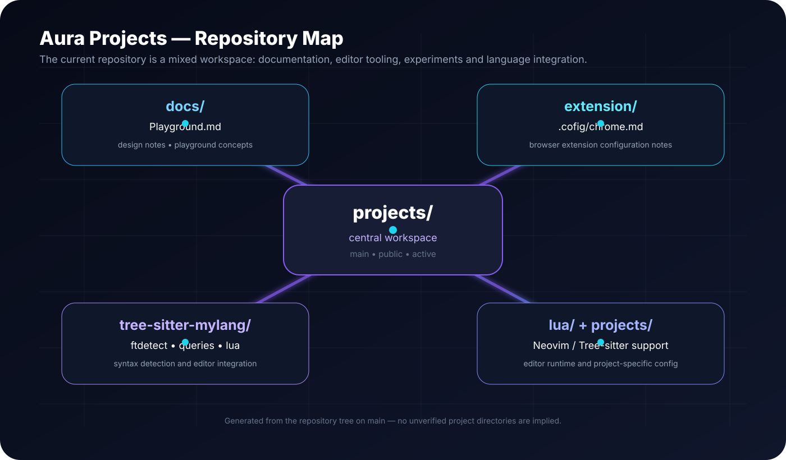

<div align="center">


# Aura Ecosystem — Projects

**A living workspace for experiments, playgrounds, editor tooling, language integration, documentation, and project infrastructure.**

[](https://github.com/auraecosystem/projects)
[](https://github.com/auraecosystem/projects/tree/main)
[](https://github.com/auraecosystem/projects)

</div>

---

## ✦ What this repository is

`auraecosystem/projects` is a public, evolving workspace rather than a single narrowly scoped application. The current tree combines documentation, editor integration, Tree-sitter query files, Lua configuration, small language/runtime experiments, and project notes.

The repository is intentionally exploratory: ideas can move from notes and experiments into reusable tooling as they mature.

> **Repository status:** active and evolving. The documentation below describes what is present in `main`; it does not pretend that planned applications or SDK integrations already exist in this repository.

## 🗺️ Repository map

<p align="center">
  
</p>

The current `main` tree contains these major areas:

```text
projects/
├── .codex/
│   └── bash.sh
├── docs/
│   └── Playground.md
├── extension/
│   └── .cofig/
│       └── chrome.md
├── lua/
│   └── tree-sitter-mylang/
│       └── init.luaau
├── projects/
│   └── tree-sitter-mylang/
│       └── Lazy.vim
├── tree-sitter-mylang/
│   ├── ftdetect/
│   │   └── mylang.vim
│   ├── lua/
│   │   └── tree-sitter-mylang/
│   │       └── init.lua
│   └── queries/
│       └── mylang/
│           ├── folds.scm
│           ├── highlights.scm
│           ├── indents.scm
│           └── textobjects.scm
├── bash.ch
├── lazy.vim
├── modelin.scala
├── todo.gyp
└── README.md
```

## 🧩 Core areas

### `tree-sitter-mylang/`

A Neovim/editor integration area for `mylang`. It contains filetype detection, Lua integration, and Tree-sitter query definitions for highlighting, indentation, folding, and text objects.

### `lua/`

Lua-side editor configuration associated with the Tree-sitter integration. The repository currently contains the `tree-sitter-mylang` module here as well as a small `.luaau` file.

### `projects/`

Project-specific editor configuration. The current tree contains a `tree-sitter-mylang/Lazy.vim` entry.

### `docs/`

Documentation and playground material. `docs/Playground.md` currently contains the repository's earlier playground/design exploration and UI direction.

### `extension/`

Browser-extension configuration notes. The current tree contains `extension/.cofig/chrome.md`.

### `.codex/`

Repository-local Codex-related material. The current tree contains `.codex/bash.sh`.

### `modelin.scala`

A compact Scala 3 modeling experiment using enums, case classes, extension methods, pattern matching, and a `@main` entry point. Its example models tasks and derives pending/high-priority task views through a functional pipeline.

### `todo.gyp` and shell files

Build/task and shell-oriented experiments live at the repository root alongside the editor configuration files.

## 🧠 Design philosophy

Aura Projects is best understood as a **workspace for convergence**:

```text
Idea
 │
 ▼
Documentation / Playground
 │
 ▼
Prototype / Experiment
 │
 ├───────────────┐
 ▼               ▼
Editor tooling   Runtime / build tooling
 │               │
 └───────┬───────┘
         ▼
     Reusable project
```

The repository can therefore hold different technologies without forcing every experiment into the same runtime, framework, or package layout.

## 🛠️ Technology surface

The current repository visibly includes:

| Area | Present in `main` |
|---|---|
| Markdown documentation | Yes |
| SVG documentation visuals | Yes, including the repository banner and architecture map |
| Lua | Yes |
| Vim / Neovim configuration | Yes |
| Tree-sitter queries | Yes |
| Vim filetype detection | Yes |
| Scala 3 experiment | Yes |
| GYP build/task file | Yes |
| Shell scripts | Yes |
| Browser-extension notes | Yes |
| Codex-related repository files | Yes |
| Discord Embedded App SDK implementation | Not currently present in the inspected tree |
| `LayoutMode.tsx` | Not currently present in the inspected tree |

That distinction matters: this README documents the repository as it exists instead of turning future UI ideas into fictional features.

## 🌌 Visual identity

The repository now includes GitHub-native SVG artwork under `assets/`:

```text
assets/
├── aura-banner.svg
└── architecture.svg
```

The artwork is deliberately dependency-free and can be rendered directly by GitHub. It uses a dark aurora treatment to give the repository a recognizable visual identity without requiring an external image host.

## 🧪 Playground direction

The existing playground documentation explores a richer Aura dashboard concept, including a premium project launcher, layout modes, Discord Embedded App ideas, project cards, and developer-console concepts.

Those ideas are treated as **design direction**, not as claims that the corresponding application is already implemented here.

For the historical playground/design material, see [`docs/Playground.md`](docs/Playground.md).

## 🌳 Tree-sitter integration

The `tree-sitter-mylang` area is structured around the conventional editor-integration pieces:

```text
tree-sitter-mylang/
├── ftdetect/
│   └── mylang.vim
├── lua/
│   └── tree-sitter-mylang/
│       └── init.lua
└── queries/
    └── mylang/
        ├── highlights.scm
        ├── textobjects.scm
        ├── indents.scm
        └── folds.scm
```

This makes the repository useful not only as a project notebook, but also as a place to evolve language/editor tooling.

## 🔬 Scala experiment

`modelin.scala` demonstrates a small functional model using Scala 3 features:

```scala
enum Priority:
  case Low, Medium, High

case class Task(
  id: Int,
  title: String,
  priority: Priority,
  completed: Boolean = false
)
```

It then uses extension methods and pattern matching to derive and format high-priority pending tasks.

## 🚀 Getting started

Clone the repository:

```bash
git clone https://github.com/auraecosystem/projects.git
cd projects
```

Inspect the current workspace:

```bash
git status
git branch --show-current
find . -maxdepth 3 -type f | sort
```

Because the repository contains several independent experiments rather than one package manager-driven application, there is intentionally no single `install` command that applies to every directory.

## 🧭 Working on a specific area

### Editor / Tree-sitter work

Start in:

```text
tree-sitter-mylang/
lua/tree-sitter-mylang/
projects/tree-sitter-mylang/
```

### Documentation / playground work

Start in:

```text
docs/Playground.md
```

### Extension configuration

Start in:

```text
extension/.cofig/chrome.md
```

### Scala experiment

Start in:

```text
modelin.scala
```

### Codex-local material

Start in:

```text
.codex/
```

## 🔄 Development flow

```text
┌──────────────┐
│ Explore idea │
└──────┬───────┘
       │
       ▼
┌──────────────────┐
│ Write playground │
│ / documentation  │
└──────┬───────────┘
       │
       ▼
┌──────────────────┐
│ Prototype inside │
│ the right area   │
└──────┬───────────┘
       │
       ▼
┌──────────────────┐
│ Validate locally │
└──────┬───────────┘
       │
       ▼
┌──────────────────┐
│ Refine / extract │
│ reusable tooling │
└──────┬───────────┘
       │
       ▼
┌──────────────────┐
│ Document the new │
│ capability       │
└──────────────────┘
```

## 🤝 Contributing

Contributions should keep the workspace understandable and preserve the separation between experiments and reusable infrastructure.

1. Choose the smallest relevant area.
2. Keep unrelated experiments out of the same change.
3. Update documentation when behavior or structure changes.
4. Preserve existing editor/query conventions when modifying `tree-sitter-mylang`.
5. Prefer small, reviewable commits.
6. Make claims in documentation match what is actually implemented.

## 📐 Documentation rules

This README follows a simple rule: **show the architecture, but do not invent it.**

When a feature is experimental, label it experimental. When a design is proposed, label it proposed. When code exists, link to the code.

That keeps the repository useful to both humans and automated tooling.

## 📚 Repository resources

- [`docs/Playground.md`](docs/Playground.md) — playground and UI exploration.
- [`tree-sitter-mylang/`](tree-sitter-mylang/) — editor and Tree-sitter integration.
- [`lua/`](lua/) — Lua configuration.
- [`extension/`](extension/) — extension configuration notes.
- [`projects/`](projects/) — project-specific configuration.
- [`modelin.scala`](modelin.scala) — Scala modeling experiment.
- [`todo.gyp`](todo.gyp) — GYP/build experiment.

## 🗺️ Roadmap

The roadmap should follow the repository's actual evolution rather than inventing release promises.

| Stage | Direction |
|---|---|
| Current | Consolidate documentation, editor tooling, experiments, and repository structure. |
| Next | Turn the strongest playground concepts into concrete, independently testable projects. |
| Later | Extract stable tooling into focused packages or dedicated repositories where that improves maintainability. |
| Future | Connect mature Aura projects through shared interfaces instead of coupling unrelated experiments prematurely. |

## ✨ Why this repository exists

A project ecosystem needs a place where ideas can breathe before they become products.

`auraecosystem/projects` provides that workspace: a place for prototypes, editor infrastructure, language experiments, documentation, and the connective tissue around larger Aura initiatives.

The goal is not to make every experiment look identical. The goal is to make the **whole ecosystem easier to explore, evolve, and understand**.

---

<div align="center">

**Aura Ecosystem** · Projects · Playground · Tooling · Experiments

<sub>Built as an evolving workspace on the <code>main</code> branch.</sub>

</div>
